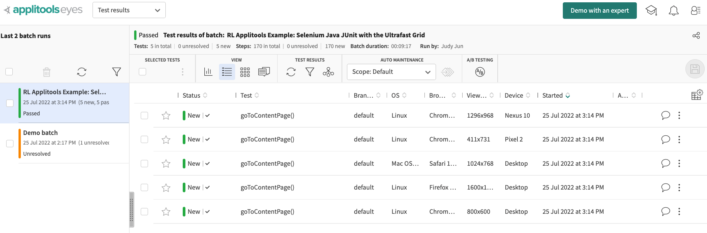
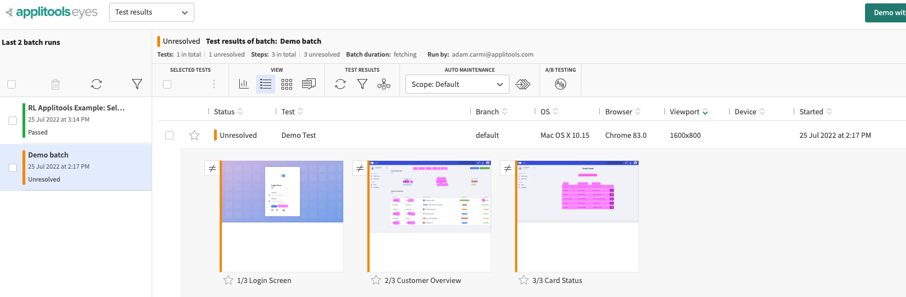

# Applitools Sample Test - Static Content Pages

This project is to demonstrate the capabilities of Applitools Eyes, a visual AI automation test platform, that periodically catches differences in static content pages not visible to the naked human eye. The changes detected may be attributed to feature changes or bugs, such changes will be highlighted in pink on the Applitools dashboard.

Applitools Eyes has been integrated with a Selenium automated test script that iterates through all rows, of which contain a base URL and a static content page's **Actual Title**, within a CSV file. The test determines if the *expected* title returned from the browser matches the *actual* title declared in the CSV file. This simple test merely serves as a conduit, to feed Applitools the static content pages to screenshot and compare.


## Table of Contents

* [Getting Started](#gettingStarted)
* [Prerequisites](#prerequisites)
* [Running Tests](#runningTests)
* [Applitools Eyes](#applitoolseyes)
  * [Part 1: API Key](#apikey)
  * [Part 2: File Path](#filePath)
  * [Part 3: Run Selenium Test](#selenium)
  * [Further customization](#customization)
* [Troubleshooting](#troubleshooting)
* [Why Use Applitools?](#whyUseApplitools)

### <a name="prerequisites"></a>Prerequisites

- Java editor (**Intellij IDEA** used for this test)
- [Applitools](https://applitools.com/) Account - Free trial account limited to 100 checkpoints (pages) per month
- Apache Maven
- Download Google [ChromeDriver](https://chromedriver.chromium.org/downloads), select download based on operating system and Chrome release version ("Chrome" --> "About Google Chrome").
  - If you are using a Mac operating system, there will be 2 options available to you depending on your processor: Intel ```chromedriver_mac64.zip``` and Apple M1 ```chromedriver_mac64_m1.zip```
  - Use "[About This Mac](https://www.howtogeek.com/706226/how-to-check-if-your-mac-is-using-an-intel-or-apple-silicon-processor/)" feature to see which ChromeDriver you'll need to download
- Applitools trial account [Sign up here](https://auth.applitools.com/users/register)
- Applitools API Key [How to find your API Key](https://applitools.com/tutorials/getting-started/setting-up-your-environment.html)

### <a name="gettingStarted"></a>Getting Started
 *Disclosure: line references may change, but as of 8/12/2022 updates have been made according to changes made to script*
 
#### <a name="chromeDriver"></a> Part 1: Set up ChromeDriver
- Download and open the ChromeDriver zip file. Copy the file path onto line 105 in place of "*<INSERT CHROME DRIVER PATH>*"
```
System.setProperty("webdriver.chrome.driver", "<INSERT CHROME DRIVER PATH>");
```

#### <a name="apikey"></a>Part 2: Export (OR Hard Code) API Key
- In order to upload test results to Applitools Eyes dashboard, you will need to set the Applitools API Key Environment Variable
- **Option 1: API Key Environment Variable**
  - To set the APPLITOOLS_API_KEY Environment Variable --> enter following in Terminal, depending on operating system:
    - Mac: ```export APPLITOOLS_API_KEY="<YOUR_API_KEY>"```
    - Windows ```set APPLITOOLS_API_KEY="<YOUR_API_KEY>"```
  - Verify env variable has been exported by entering ```printenv``` into Terminal. This command should return a list of environmental variables including ```"APPLITOOLS_API_KEY"```
- **Option 2: Hard code API Key** (Avoid hard coding unless test keeps returning with ```java.langIllegalArgumentException: 'apiNull'```)

  - Comment out line 48 (``` applitoolsApiKey = System.getenv("APPLITOOLS_API_KEY");```) and hard code API Key instead with ```applitoolsApiKey="<your_api_key>";``` on line 50. (*I personally found it took some time for the environment variable to be processed, hard coded API for easier access)

#### <a name="filePath"></a>Part 3: File Path
- Line 140 contains the path to the sample CSV file. If path should not work, download CSV file and enter local path
```
List<ArrayList<String>> pages = CSVReader.getContentPages("INSERT_LOCAL_FILE_PATH");
```
- Selenium test currently hard coded to retrieve CSV file index [0] (Content Page base URL) and [2] (Content Page Actual Title).

#### <a name="customization"></a> Further Customization
- To change test batch name, edit parameter within line 67 ```config.setApiKey(applitoolsApiKey);```
- Option to change configuration of browser and/or device anywhere after line 82 but before 96

### <a name="runningTests"></a>Running Test
- Run```RLContentPageTests.java```
- Test length will vary depending on size of CSV file. CSV file included in this test (US Content Pages - Affiliate.csv) takes on average 20 seconds to run.
  - *Note: CSV file has been reduced to 3 lines, as free trial is limited to 100 checkpoints (3 content pages are checked 5 times - see [ApplitoolsEyes](#applitoolsEyes) for further explanation)

### <a name="applitoolsEyes"></a>Applitools Eyes
- Check dashboard. First test run should result in the following:
  
  - First test will always return with green status "New"
  - 5 tests will return:
    - 3 tests running with the following Desktop browsers: Safari, Firefox, Chrome
    - 2 tests running on Mobile devices, for horizontal and vertical views
  - Any tests run after the initial, will either return with green status "Pass" if no changes have been made to content pages, or with orange status as "Unresolved"
  - Unresolved changes indicates a "mismatch". Changes have been made and said changes will be highlighted in pink. (example demonstrated in Demo Batch test)
    
  - Test status will remain Unresolved unless approved by user.
  

### <a name="troubleshooting"></a>Troubleshooting

**Common Errors**
- **Error**: "*API Key null*"
  - ***Cause***: Running test before exporting API environment variable 
  - ***Solution***: If test returns with error ```'java.lang.IllegalArgumentException: apiKey is null'```...check environment variable ```echo $APPLITOOLS_API_KEY```. If Environment Variable exists but test continues to return in error, you will need to hard code API Key. (see [Part 2: API Key](#apikey) - "Option 2: Hard code API Key")
- **Error**: "Package doesn't exist"
  - ***Cause***: Dependency issues 
  - ***Solution***: Invalidate cache (File --> 'Invalidate Cache'), then rebuild project (Build --> 'Rebuild Project')
- Don't see your error here? See [Common Issues](https://applitools.com/tutorials/getting-started/common-issues.html)

**Limitations**
  - Free trial account is limited to 100 checkpoints (AKA 100 page checks). 
  - As Applitools Eyes will run test on 3 different browsers and 2 types of devices, the number of rows in the CSV file will be run 5x.
    - To circumvent multiple checkpoints, comment out any of the following located towards the end of ```@BeforeAll```. Just ensure at least one is left, otherwise test will not run.
    ```
    config.addBrowser(1600, 1200, BrowserType.CHROME);
    config.addBrowser(1366, 784, BrowserType.FIREFOX);
    config.addBrowser(1024, 768, BrowserType.SAFARI);
    config.addDeviceEmulation(DeviceName.Nexus_10, ScreenOrientation.LANDSCAPE);
    config.addDeviceEmulation(DeviceName.iPhone_11, ScreenOrientation.PORTRAIT);
    ```
    - Edited CSV file to cut all but 3 rows from file, to prolong trial account use. 
    - After 100 checkpoints have been passed, no more tests can be run, however results still available for view.

## Built With
- [Applitools](https://applitools.com/docs/index.html)
- [Selenium](https://www.selenium.dev/documentation/)
- [Maven](https://maven.apache.org/guides/index.html)
- Template from: "Applitools Selenium Java Junit w/Ultrafast Grid [tutorial](https://applitools.com/tutorials/selenium-java-junit-ufg.html)"


## Authors
- Shane Jun - **Initial work** - shane-jeon
